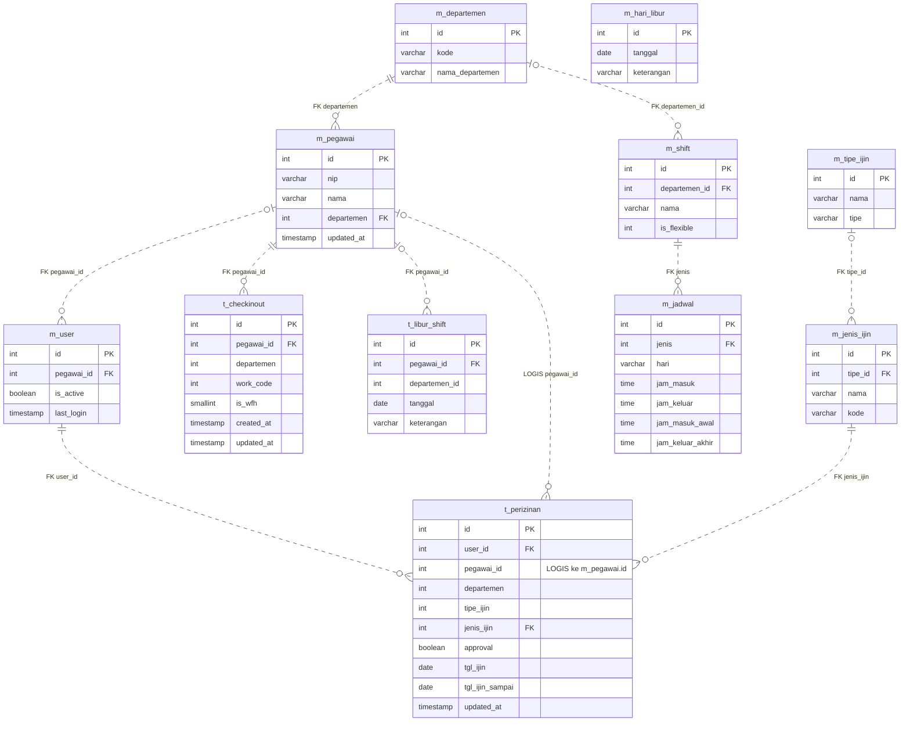

# ERD sumber OLTP untuk migrasi Apache Hop

Diverifikasi dari metadata database OLTP dan pembacaan sumber ETL pada 29 September 2026. Cakupan: 11 tabel yang dibaca ETL saat ini, bukan seluruh database aplikasi. Kolom ditampilkan secara selektif.

PK = primary key aktual; FK = foreign key aktual. Label LOGIS menunjukkan relasi yang digunakan ETL tetapi tidak dijamin constraint database. Garis titik pada Mermaid merupakan relasi non-identifying, bukan penanda ketiadaan FK. Kardinalitas relasi logis menggambarkan tujuan pemetaan; orphan harus divalidasi.

## Fungsi tabel dalam migrasi

| Tabel | Fungsi |
|---|---|
| m_departemen | Sumber dimensi departemen dan lingkup jadwal |
| m_pegawai | Sumber dimensi pegawai dan populasi dasar pegawai-hari |
| m_shift, m_jadwal | Sumber jadwal kerja per departemen dan hari |
| m_hari_libur | Sumber kalender hari libur berdasarkan tanggal; tidak memiliki FK ke tabel presensi |
| t_libur_shift | Pengecualian hari kerja per pegawai dan tanggal |
| t_checkinout | Event presensi; ETL saat ini memilih work_code = 1 |
| m_tipe_ijin, m_jenis_ijin | Referensi klasifikasi izin |
| t_perizinan | Pengajuan, rentang tanggal, dan keputusan izin |
| m_user | Sumber analytical_user pada initial load, serta induk user_id pada pengajuan izin; bukan sumber role SSO final |

## Catatan relasi dan business rule

- Diagram menampilkan jalur relasi utama yang relevan untuk ETL. Kolom departemen pada t_checkinout/t_perizinan dan departemen_id pada t_libur_shift tidak memiliki FK departemen pada database yang diperiksa. t_perizinan.tipe_ijin juga tidak memiliki FK; hubungan tipe yang dijamin adalah m_jenis_ijin.tipe_id ke m_tipe_ijin.id.
- ETL menghubungkan izin ke pegawai melalui t_perizinan.pegawai_id, bukan semata-mata melalui user_id. Validasi kesesuaian kedua identitas perlu dirancang di Hop.
- Tidak ada jaminan satu akun per pegawai hanya dari FK m_user.pegawai_id. Jangan menganggap relasi 1:1 tanpa pemeriksaan constraint/data.
- Jadwal ETL saat ini ditentukan melalui departemen pegawai -> m_shift -> m_jadwal, lalu dicocokkan dengan hari. Kombinasi departemen dan hari harus tidak ambigu.
- t_checkinout juga memiliki checktype dan jadwal_id, tetapi belum dipakai oleh transformasi presensi saat ini. Arti serta kelengkapan datanya perlu divalidasi sebelum mengubah aturan di Hop.
- m_pegawai.status merujuk m_previleges, bukan otomatis status aktif/nonaktif pegawai. m_previleges, m_lokasi, dan m_group adalah referensi aplikasi di luar cakupan ekstraksi ETL saat ini.
- Tidak ada tabel sumber khusus untuk tidak masuk tanpa izin. Status tersebut diturunkan dari pegawai x tanggal, jadwal wajib kerja, tidak adanya presensi, dan tidak adanya izin sah.
- Kalender lengkap dibentuk saat ETL; m_hari_libur hanya menyediakan tanggal pengecualian.
- Kolom created_at/updated_at dan kolom payload lainnya disederhanakan di diagram. Diagram ini bukan daftar SELECT final untuk pipeline Hop.
